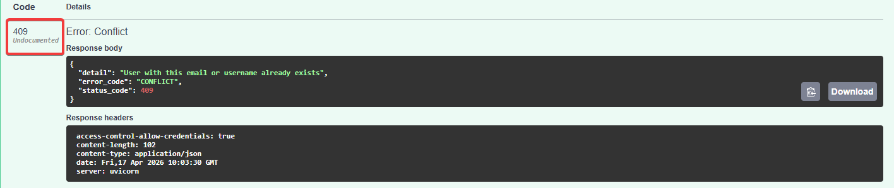

# Найденные баги при ручном тестировании API (Project: QA Sandbox)

В данном документе представлены баг-репорты найденные при тестировании API эндпоинтов.
Объект тестирования: [QA Automation Sandbox](https://github.com/manikosto/qa-automation-sandbox)


# Список найденных дефектов (Issues)

| ID | Название бага | Приоритет | Статус |
|:---|:---|:---:|:---:|
| [API_BUG_ID-001](#api_bug_id-001) | Отсутствие 409 в Swagger | Low | Open |
| [API_BUG__ID-002](#api_bug_id-002-сохранение-неэкранированного-javascript-кода-в-поле-display_name-потенциальный-xss) | Сохранение неэкранированного JavaScript-кода в поле display_name (Потенциальный XSS) | Medium | Open |

---
# API_BUG_ID-001. Отсутствие описания ошибки 409 Conflict в Swagger для эндпоинта регистрации
**Приоритет:** Low (Низкий)

**Тип:** Bug (Documentation)

**Описание:**

    При попытке регистрации пользователя с уже существующим email или username, сервер возвращает статус-код 409 Conflict. Однако в документации Swagger (эндпоинт POST /api/auth/register) данный код ответа отсутствует в списке возможных (отмечен как Undocumented).

**Связанный тест-кейс:** [TC-API-REG-02](API_Registration_Test_Cases.md#tc-reg-02-регистрация-на-уже-существующий-email). Регистрация на уже существующий Email

**Шаги воспроизведения:**

* Открыть Postman (или Swagger UI).

* Выполнить запрос **POST /api/auth/register** с данными уже существующего пользователя.

* Посмотреть на полученный статус-код и описание в Swagger.

**Фактический результат:**
* Сервер возвращает **409 Conflict.** В Swagger ответ помечен как Undocumented.



**Ожидаемый результат:**
* Статус-код **409 Conflict** должен быть описан в документации Swagger с примером тела ответа, чтобы фронтенд-разработчики могли корректно обрабатывать это исключение.

---


# API_BUG_ID-002. Сохранение неэкранированного JavaScript-кода в поле display_name (Потенциальный XSS)
**Приоритет:** Medium (Средний)

**Тип:** Security Vulnerability

**Описание:**
Эндпоинт регистрации `POST /api/auth/register` позволяет сохранять в поле `display_name` строки, содержащие исполняемый JavaScript-код (например, `<script>alert('xss')</script>`). Бэкенд принимает такие данные и сохраняет их в базу данных в "чистом" виде без предварительной санитизации или экранирования спецсимволов.

**Связанный тест-кейс:** [TC-REG-16](API_Registration_Test_Cases.md#tc-reg-16-проверка-на-xss-уязвимость-в-поле-display-name)

**Шаги воспроизведения:**
1. Открыть Postman.
2. Выполнить запрос `POST /api/auth/register` со следующим телом:
   ```json
   {
     "email": "xss_test@example.com",
     "username": "xss_warrior",
     "password": "password123",
     "display_name": "<script>alert('xss')</script>"
   }
3. Проверить ответ сервера.
4. Проверить содержимое колонки `display_name` в таблице `users` через БД-клиент (pgweb/DBeaver).

**Фактический результат:**
* Сервер возвращает статус-код `201 Created`.
* В базе данных значение сохранено в исходном виде: `<script>alert('xss')</script>`.

**Ожидаемый результат:**
Бэкенд должен либо отклонять ввод спецсимволов `< >` (возвращать 422), либо экранировать их перед сохранением в БД (например, заменять на `&lt;script&gt;...`), чтобы предотвратить выполнение скрипта на стороне фронтенда (Stored XSS).

**Комментарий:** Данная уязвимость несет риск безопасности пользователей. Если фронтенд-часть приложения не имеет собственной защиты от XSS, вредоносный скрипт будет исполнен в браузере любого пользователя, открывшего профиль данного игрока.