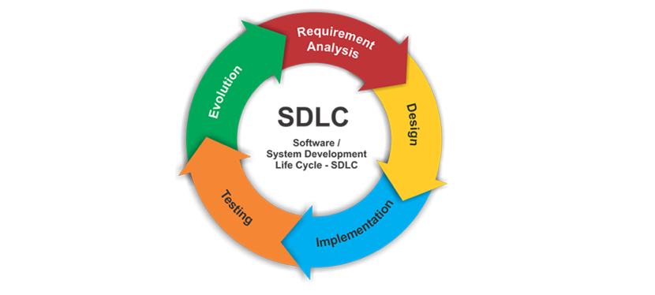

# 02. Жизненный цикл разработки ПО (SDLC)

**SDLC (Software Development Life Cycle)** — это процесс, используемый командами разработчиков для проектирования, разработки и тестирования качественного программного обеспечения.

## 1. Основные фазы SDLC
Процесс разработки обычно делится на следующие этапы:

1.  **Сбор и анализ требований (Planning & Requirements):** Определение того, что должен делать продукт.
2.  **Проектирование (Design):** Архитектура системы, дизайн интерфейсов (UI/UX), логика баз данных.
3.  **Разработка (Development):** Написание программного кода.
4.  **Тестирование (Testing):** Проверка продукта на соответствие требованиям и поиск дефектов.
5.  **Релиз и Внедрение (Deployment):** Выпуск продукта на рынок или передача заказчику.
6.  **Сопровождение (Maintenance):** Исправление найденных пользователями ошибок и доработка функционала.

* Примерная схема SDLC:

## 2. Роль QA на каждом этапе
Современный подход (Shift-Left Testing) предполагает участие тестировщика на всех стадиях, а не только в конце:

* **На этапе требований:** QA проверяет документацию на логические ошибки. *Чем раньше найдена ошибка в логике, тем дешевле ее исправить.*
* **На этапе дизайна:** Оценка тестопригодности (Testability) будущей системы и подготовка стратегии тестирования.
* **На этапе разработки:** Написание тест-кейсов и чек-листов, подготовка тестовых данных.
* **На этапе тестирования:** Непосредственный запуск проверок и отчетность по дефектам.
* **На этапе поддержки:** Анализ отзывов пользователей и проверка исправлений (Hotfixes).

## 3. Модели SDLC (Краткий обзор)
Хотя методологии будут разобраны отдельно, стоит знать основные подходы к жизненному циклу:

| Модель | Суть | Плюсы | Минусы |
| :--- | :--- | :--- | :--- |
| **Waterfall** (Каскадная) | Строго последовательные этапы. | Простота планирования. | Тестирование в самом конце; сложно вносить изменения. |
| **V-Model** | Тестирование планируется параллельно каждой фазе разработки. | Высокое качество, акцент на раннее тестирование. | Недостаточная гибкость. |
| **Iterative / Agile** | Цикличная разработка короткими итерациями (спринтами). | Гибкость, быстрая обратная связь. | Сложно оценить итоговые сроки и бюджет. |

## 4. Почему важно знать SDLC тестировщику?
Понимание SDLC позволяет QA-инженеру:
1.  **Понимать контекст:** На каком этапе находится проект и какие риски актуальны сейчас.
2.  **Влиять на качество раньше:** Не ждать готового кода, а предотвращать ошибки еще в тексте требований.
3.  **Планировать ресурсы:** Знать, когда потребуется больше времени на регрессию или подготовку окружения.