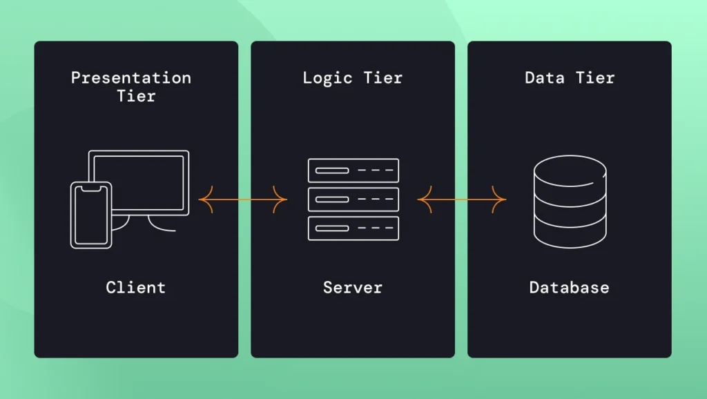

# 10. Клиент-серверная архитектура и типы систем

Понимание того, как данные ходят между клиентом и сервером — это база для тестирования API, веб- и мобильных приложений.

## 1. Основы взаимодействия
**Клиент-серверная архитектура** — это модель, в которой задачи распределены между поставщиками услуг (**серверами**) и заказчиками услуг (**клиентами**).

* **Клиент (Frontend):** Интерфейс, с которым взаимодействует пользователь (браузер, мобильное приложение). Его задача — отправить запрос и отобразить ответ.
* **Сервер (Backend):** «Мозги» системы. Обрабатывает запросы, выполняет бизнес-логику, проверяет права доступа и работает с базой данных.
* **База данных (DB):** Хранилище информации (пользователи, товары, заказы).
* **API (Application Programming Interface):** Набор правил и протоколов, по которым клиент и сервер «договариваются» друг с другом.

## 2. Монолит vs Микросервисы
Архитектура бэкенда напрямую влияет на то, как мы строим стратегию тестирования.

| Характеристика | Монолит (Monolith) | Микросервисы (Microservices) |
| :--- | :--- | :--- |
| **Структура** | Единый код, одна база данных, все функции внутри одного приложения. | Система разбита на маленькие независимые сервисы по бизнес-функциям. |
| **Плюсы** | Проще разрабатывать и деплоить на старте. Легкое сквозное тестирование. | Масштабируемость, изолированность ошибок, гибкость технологий. |
| **Минусы** | Трудно масштабировать. Одна ошибка может «уронить» всё приложение. | Сложность интеграции, сетевые задержки, трудности с транзакциями. |
| **Тестирование** | Упор на регрессионное тестирование всей системы целиком. | Упор на интеграционное тестирование (взаимодействие сервисов) и контрактное тестирование. |

## 3. Дополнительные компоненты
В реальных системах (особенно высоконагруженных, как к примеру Wildberries) между клиентом и сервером стоят:
* **Балансировщик нагрузки (Load Balancer):** Распределяет запросы между несколькими серверами, чтобы избежать перегрузки.
* **Кэш (Cache):** Быстрое промежуточное хранилище (например, Redis) для данных, которые запрашивают очень часто.
* **Брокеры сообщений (Message Brokers):** Инструменты для асинхронного общения между микросервисами (Kafka, RabbitMQ).

---

### Что это значит для QA?
1.  **Если падает монолит** — скорее всего, не работает всё приложение.
2.  **Если падает микросервис** — может не работать только одна функция (например, нельзя применить промокод, но корзина работает).
3.  **Тестирование требует знания «точек соприкосновения»**: где фронт стучится в бэк, и как бэк общается с базой или другими сервисами.